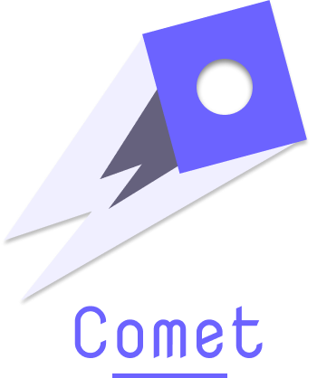

# Comet programming language 



- A simple programming language aimed to be used for educational purposes, and to teach how programming language interpreters
can be made.

- Since it's made for educational purposes, all the parts that make a lexer are made from scratch `lexer`, `parser` and `evaluator`.

## Language Example 

- The language is a `C` derived language, with the ability to create `structs` as complex types, and declare functions as First class values.
- The language is dynamically typed, to make it easier to implement

```
// variable declarations
var a = 10
var c = "some string"
var arrayValue = [1, 2, 3]

var add = func(a, b) {
    return a + b
}

var isBigger = func(a, b) {
    return a > b
}

var equal = func(a, b) {
    return a == b
}

// Object declaration
var object = new()
object.field = "field value"

object.method = func(a) {
    return a * 2
}

var value = object.call()

var loopConstruct = func(a, b) {
    var sum = 0
    for i = 1; i < 10; i += 1 {
        sum += i
    }
    return sum
}

var conditional = func(a, b) {
}
// a program entrypoint
func main() {
    var c = a + add(1, 4)
    // builtin functions
    println(c)
}
```

## Grammar

- Below are the grammar rules for the language (it can be left recursive, we will deal with it at some point)

```
// Parser rules
grammar Comet;

comet:
    function_declaration+ EOF
    ;

function_declaration:
    'func' IDENTIFIER'('parameterless')' '{' statements '}' # functionDeclaration
    ;

parameterless:
    parameters*
    ;

parameters:
    IDENTIFIER(','IDENTIFIER)* | expression (','expression)*
    ;

statements:
    statement*
    ;

statement:
    assignment_statement                      # assignment
    | if_statement                            # ifStatement
    | return_statement                        # returnStatement
    | for_loop                                # forLoop
    ;

assignment_statement:
    IDENTIFIER '=' expression
    ;

if_statement:
    'if' '('expression')' '{' statements '}' ('else' '{' statements '}')?
    ;

return_statement:
    'return' expression
    ;

for_loop:
    'for' '('expression')' '{' statements '}'
    ;

# struct and object declaration to be defined later
# struct_statement:
#    'struct' IDENTIFIER '{' FIELD* '}'

expression:
    function_call
    | IDENTIFIER
    | STRING 
    | NUMBER 
    | BOOL 
    | string_concat
    | math_expression
    | array_declaration
    ;

array_declaration:
    '['(expression (','expression)*)?']'

function_call:
    IDENTIFIER '('parameterless')'
    ;

string_concat:
    STRING ('+' STRING)*
    ;

math_expression:
    term (('+' | '-') term)*
    ;

term:
    factor (('*' | '/') factor)*
    ;

factor:
    IDENTIFIER
    | string
    | number
    | '('expression')'
    ;

// Lexer rules

WS : [ \t\r\n\u000C]+ -> skip;
COMMENT : '/*' .*? '*/' -> skip;
LINE_COMMENT : '//' ~[\r\n]* -> skip;
IDENTIFIER: ('_'|LETTER)(LETTER|DIGIT|'_')*;
NUMBER: ('-' | '+')? (([1-9][0-9]*) | ([0-9]));
OPERATOR: '+' | '-' | '*' | '/' | '%' | '!';
fragment DIGIT: [0-9];
BOOL: 'true' | 'false';
LETTER: [a-zA-Z];
STRING: '"' ~('\r' | '\n' | '"')* '"' ;
```

## Tasks

These are the list of the tasks that I think should be done before having the first release:

- [x] Add variable declarations
- [x] Add conditionals
- [ ] Add Proper scoping
- [ ] Add support for loops 
- [ ] Add Arrays support
- [ ] Add Comments support
- [ ] Add Hash support
- [ ] Add import modules support
- [ ] Add testing framework 
- [ ] Add build system
- [ ] Add a standard library

## Contribution

- Feel free to submit new issues, or pull requests.
